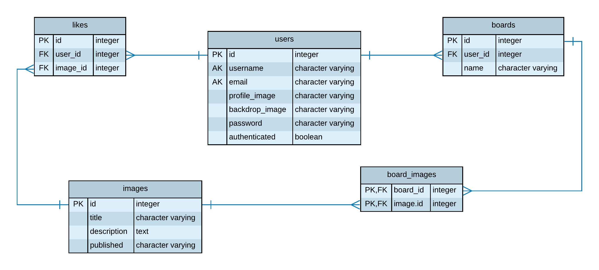

# Smitty Application          
      
> Remix, discover, reimagine,   
> create and design   


## Description

The Smitty Application provides access to over 175 years of history, art, science and culture. Virtually explore the Smithsonian's nineteen museums, research centers, libraries, archives and the National Zoo. Browse and search almost 3 million 2D and 3D works of art and data. Search open access content by topic, date range or keyword.

## Features
  - Create a free user account to search for images 
  - Smithsonian search tool
  - Save your favorite images  
  - Future Features:
    - Download images
    - Share your discoveries
    - Follow your favorite topics
    - Create galleries

## Approach
API requests will filter for only Creative Commons Zero (CCO) to ensure that only context that does not require attribution or citation is accessed. Search results will include the following content: content URL, title, author, date and collection.

Search content by category or topic.

## API Reference
[Smithsonian Institution Open Access API](http://edan.si.edu/openaccess/apidocs/)


> Find inspiration, learn something new   
> or download artwork to create something beautiful.   
 

## Tech Sources
Smithsonian Open Access Application uses:
* Python 
* Javascript 
* HTML 
* Bootstrap
* jQuery
* PostgreSQL
* SQLAlchemy
* Jinja
* Heroku 

### Usage   
Smitty can be run using either in development or production mode. Development includes mock external API request results, and a Flask-DebugToolbar. Development can be enabled in app.py using:  
``` python
DEV = True
```  

To access the Smithsonian's OpenAccess API endpoints, an API key key can be added to secure.py. API key requests can be made by registering with [data.gov](https://api.data.gov/signup/).

### Contribute 
Pull requests are always welcome.  


### Future Schema (ERD)
